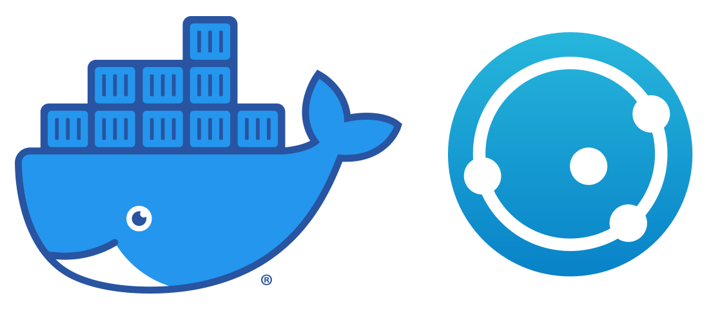

docker-syncthing
================

    

    
    
    
     
    
    
    
    

    Docker image for <a href="https://syncthing.net">Syncthing</a> client/node.

---

Running the Container
---------------------

First create some named data volumes to hold the persistent data:

    docker volume create --name syncthing-config
    docker volume create --name syncthing-data

Then run the Syncthing client:

    docker run -d -p 8384:8384 -p 21025:21025/udp -p 22000:22000 -v syncthing-config:/etc/syncthing -v syncthing-data:/vol/storage --name syncthing-client phlak/syncthing

#### Optional arguments

<dl>
  <dt><code>-v /local/somedir:/vol/storage/somedir</code></dt>
  <dd>Map a directory (i.e. <code>/local/somedir</code>) on the host OS to the running container.  This is useful for syncing files on the host system through the container. This replaces the <code>-v syncthing-data:/vol/storage</code> run argument.</dd>

  <dt><code>-e TZ=America/Phoenix</code></dt>
  <dd>Set the timezone for your server. You can find your timezone in this <a href="https://goo.gl/uy1J6q">list of timezones</a>. Use the (case sensitive) value from the <code>TZ</code> column. If left unset, timezone will be UTC.</dd>

  <dt><code>--restart unless-stopped</code></dt>
  <dd>Always restart the container regardless of the exit status, but do not start it on daemon startup if the container has been put to a stopped state before. See the Docker <a href="https://goo.gl/Y0dlDH">restart policies</a> for additional details.</dd>
</dl>

Troubleshooting
---------------

For general help and support join our [Spectrum Community](https://spectrum.chat/phlaknet) or reach out on [Twitter](https://twitter.com/PHLAK).

Please report bugs to the [GitHub Issue Tracker](https://github.com/PHLAK/docker-syncthing/issues).

Copyright
---------

This project is licensed under the [MIT License](https://github.com/PHLAK/docker-syncthing/blob/master/LICENSE).
